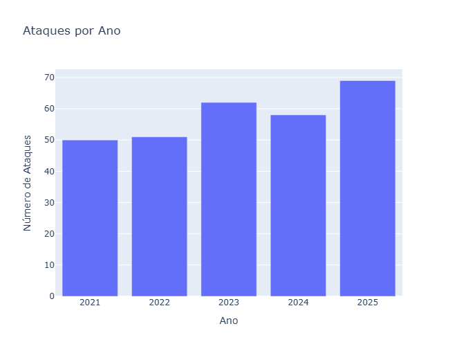
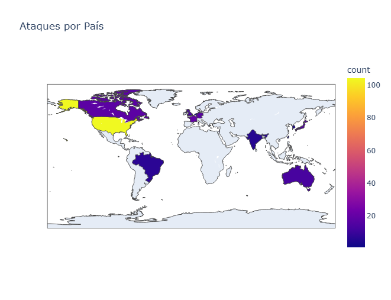
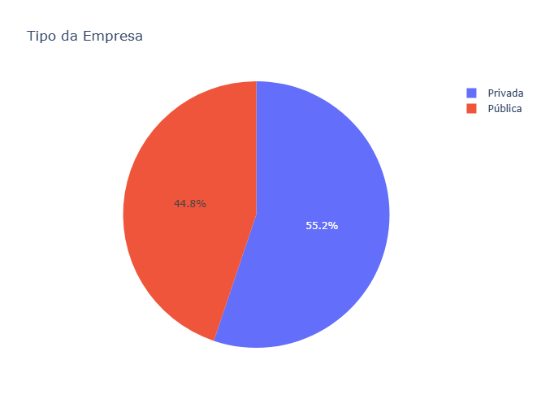

# Semana 03 - Análise de Incidentes de Segurança Cibernética

Esta pasta contém scripts e dados para análise de incidentes de segurança cibernética, incluindo limpeza de dados, exploração e visualização.

## Arquivos

- **01_explore_data.py**: Script para exploração inicial dos dados.
- **02_clean_data.py**: Script para limpeza e processamento dos dados de incidentes.
- **03_analyze_private.py**: Script para análise de dados privados relacionados aos incidentes.
- **04_visualize_incidents.py**: Script para gerar visualizações dos incidentes.
- **grafico_ataques_por_ano.html**: Visualização HTML dos ataques por ano.
- **grafico_ataques_por_ano.png**: Imagem PNG da visualização dos ataques por ano.
- **grafico_ataques_por_pais.html**: Visualização HTML dos ataques por país.
- **grafico_ataques_por_pais.png**: Imagem PNG da visualização dos ataques por país.
- **grafico_tipo_empresa.html**: Visualização HTML dos tipos de empresa afetadas.
- **grafico_tipo_empresa.png**: Imagem PNG da visualização dos tipos de empresa afetadas.
- **incidents_master.csv**: Conjunto de dados bruto dos incidentes principais.
- **incidents_master_cleaned.csv**: Conjunto de dados limpo dos incidentes principais.
- **nao_utilizado_financial_impact.csv**: Tabela complementar sobre o impacto financeiro dos incidentes (pode ser utilizada no futuro).
- **nao_utilizado_market_impact.csv**: Tabela complementar sobre o impacto no mercado (pode ser utilizada no futuro).

## Visualizações

Aqui estão as visualizações geradas pelos scripts:

### Ataques por Ano


### Ataques por País


### Tipos de Empresa Afetadas


## Como executar

1. Certifique-se de ter um ambiente Python configurado.
2. Instale as dependências necessárias, como `plotly`:
   ```
   pip install plotly
   ```
3. Execute os scripts Python conforme necessário, por exemplo:
   ```
   python 01_explore_data.py
   python 02_clean_data.py
   python 03_analyze_private.py
   python 04_visualize_incidents.py
   ```

## Notas

- Os arquivos HTML podem ser abertos em um navegador para visualizar os gráficos.
- Os dados CSV contêm informações sobre incidentes de segurança para análise.
- Os arquivos com prefixo "nao_utilizado_" são tabelas complementares que podem ser utilizadas em análises futuras.